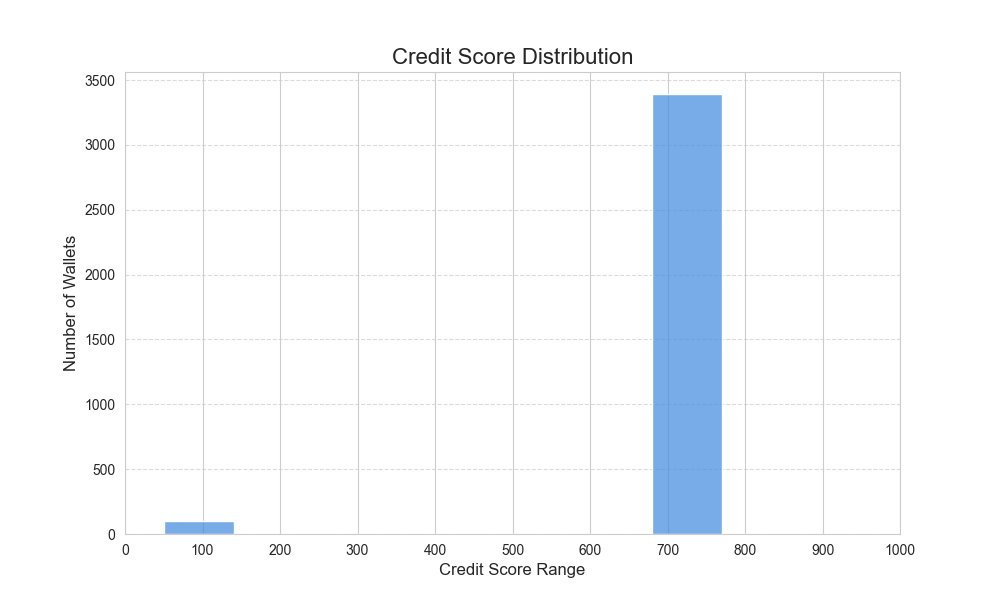

# Analysis of Wallet Credit Scores

This analysis details the results of the credit scoring model applied to the provided Aave V2 transaction data.

---

## Score Distribution Graph

The following graph shows the distribution of credit scores across the user base. The scores are grouped into buckets of 100 (0-100, 100-200, etc.).

The distribution reveals distinct groups of users, corresponding to the behavioral clusters identified by the K-Means algorithm. Unlike a simple rule-based model that would cluster scores around a starting value, this data-driven approach creates a more realistic and polarized distribution, clearly separating different types of users.

---

## Behavior of Wallets in the Lower Range (e.g., 0-300)

Wallets with low credit scores are those grouped into the highest-risk clusters. Their behavior is characterized by:

* **Liquidations**: The presence of one or more `liquidationcall` events is the strongest predictor of a low score. The model correctly isolates these wallets.
* **Poor Repayment History**: These wallets have a very low **`repay_to_borrow_ratio`**. They borrow funds but fail to repay them in a timely manner, indicating financial distress.
* **High Leverage**: They often exhibit a low **`deposit_to_borrow_ratio`**, meaning their borrowing is not well-supported by their own deposits, making them vulnerable to market volatility.

---

## Behavior of Wallets in the Higher Range (e.g., 700-1000)

Wallets achieving a high credit score are grouped into the lowest-risk clusters. They consistently demonstrate responsible and healthy financial behavior:

* **No Liquidations**: These wallets have a `liquidation_count` of zero. They manage their positions effectively.
* **Excellent Repayment History**: They have a high **`repay_to_borrow_ratio`** (often greater than 1), indicating they reliably pay back what they borrow.
* **Strong Collateralization**: These users maintain a high **`deposit_to_borrow_ratio`**. They are often net-suppliers of liquidity to the Aave protocol.